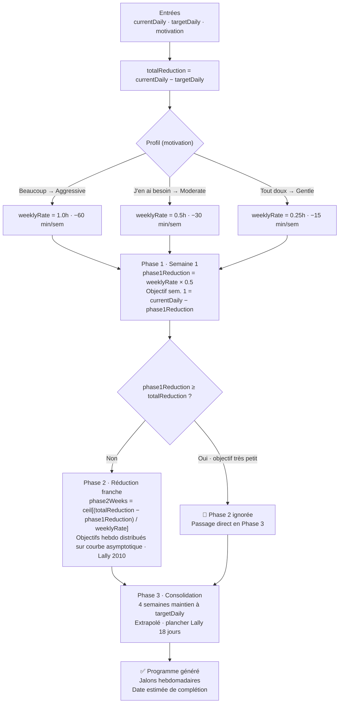

# Algorithme 1 — Génération du programme de progression

*Diagramme source : `algo1_definition_progression.png`*

Calcule le programme de réduction du temps d'écran à partir des entrées de l'utilisateur (usage actuel, objectif cible, niveau de motivation) et génère les 3 phases du programme.

## Logique résumée

1. **Entrées** : `currentDaily`, `targetDaily`, `motivation`
2. `totalReduction = currentDaily − targetDaily`
3. Le profil de motivation déclaré détermine le `weeklyRate` :
   - Beaucoup → **Aggressive** : 1.0h, soit −60 min/sem
   - J'en ai besoin → **Moderate** : 0.5h, soit −30 min/sem
   - Tout doux → **Gentle** : 0.25h, soit −15 min/sem
4. **Phase 1** (semaine 1) : réduction à demi-rythme (`weeklyRate × 0.5`), conformément à la courbe de Lally (résistance initiale maximale).
5. Si `phase1Reduction ≥ totalReduction`, la Phase 2 est ignorée (objectif déjà très proche) → passage direct en Phase 3.
6. Sinon, **Phase 2** : nombre de semaines = `ceil[(totalReduction − phase1Reduction) / weeklyRate]`, objectifs hebdomadaires distribués sur une courbe asymptotique.
7. **Phase 3** : 4 semaines de maintien à `targetDaily` (consolidation, extrapolé du plancher Lally de 18 jours).
8. Le programme généré inclut les jalons hebdomadaires et la date estimée de complétion.
