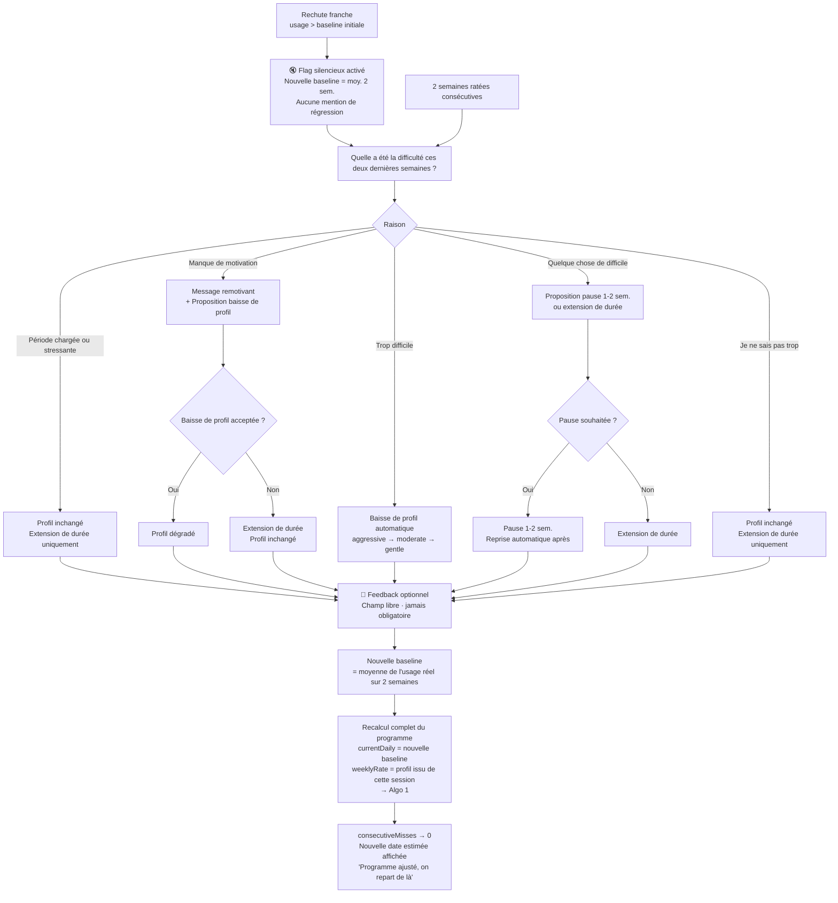

# Algorithme 2 — Recalibrage dynamique (rechute / objectifs manqués)

*Diagramme source : `algo2_ajustement_cas_depassement.png`*

Se déclenche en cas de rechute franche (usage redevenu supérieur à la baseline initiale) ou de 2 semaines consécutives où l'objectif n'a pas été tenu. Recalibre le programme sans pénaliser ni dramatiser, conformément au modèle de Fogg (la motivation fluctue, l'écart est statistiquement normal).

## Logique résumée

- **Déclencheurs** : rechute franche (usage > baseline initiale) → active un flag silencieux, nouvelle baseline = moyenne sur 2 semaines, sans mention explicite de régression à l'utilisateur ; ou 2 semaines ratées consécutives.
- L'app pose une question ouverte : *« Quelle a été la difficulté ces deux dernières semaines ? »*
- Selon la raison choisie :
  - **Période chargée ou stressante** → profil inchangé, extension de durée uniquement.
  - **Manque de motivation** → message remotivant + proposition de baisse de profil (acceptée → profil dégradé ; refusée → extension de durée, profil inchangé).
  - **Trop difficile** → baisse de profil automatique (aggressive → moderate → gentle).
  - **Quelque chose de difficile** → proposition de pause de 1-2 semaines ou d'extension de durée (pause acceptée → reprise automatique après ; refusée → extension de durée).
  - **Je ne sais pas trop** → profil inchangé, extension de durée uniquement.
- Un feedback libre et optionnel est proposé dans tous les cas (jamais obligatoire).
- La nouvelle baseline est recalculée comme la moyenne de l'usage réel sur les 2 dernières semaines.
- Le programme est entièrement recalculé (`currentDaily` = nouvelle baseline, `weeklyRate` = profil issu de cette session) en repassant par l'Algorithme 1.
- `consecutiveMisses` est remis à 0, et une nouvelle date estimée est affichée avec un message rassurant : *« Programme ajusté, on repart de là »*.
