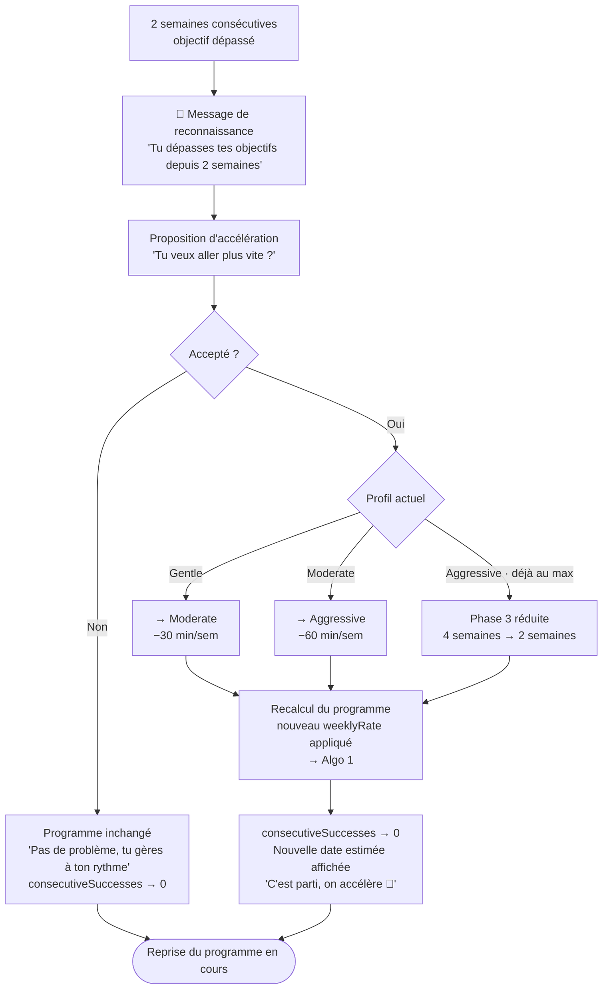

# Algorithme 3 — Accélération (réussite critique)

*Diagramme source : `algo3_acceleration_cas_reussite_critique.png`*

Se déclenche après 2 semaines consécutives où l'objectif est dépassé. Propose à l'utilisateur d'accélérer son programme.

## Logique résumée

1. **Déclencheur** : 2 semaines consécutives avec objectif dépassé.
2. Message de reconnaissance : *« Tu dépasses tes objectifs depuis 2 semaines »*.
3. Proposition d'accélération : *« Tu veux aller plus vite ? »*
4. Si **refusé** : programme inchangé, `consecutiveSuccesses → 0`, message *« Pas de problème, tu gères à ton rythme »*.
5. Si **accepté**, le profil actuel détermine la suite :
   - **Gentle** → passe à **Moderate** (−30 min/sem)
   - **Moderate** → passe à **Aggressive** (−60 min/sem)
   - **Aggressive** (déjà au maximum) → Phase 3 réduite de 4 à 2 semaines
6. Le programme est recalculé avec le nouveau `weeklyRate` (retour à l'Algorithme 1).
7. `consecutiveSuccesses → 0`, nouvelle date estimée affichée avec le message *« C'est parti, on accélère 🚀 »*.
8. Reprise du programme en cours.
