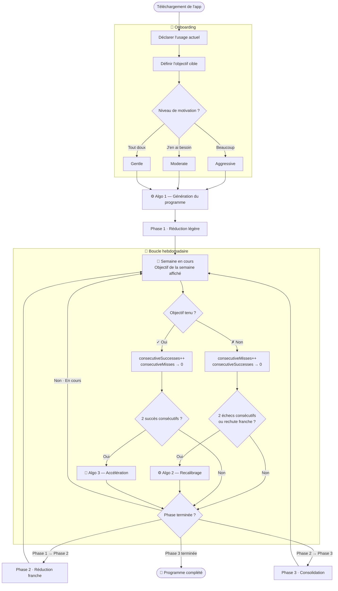

# Flow général de l'application Doo

*Diagramme source : `Flow_generale.png`*

Vue d'ensemble du parcours utilisateur, du téléchargement de l'app jusqu'à la complétion du programme, intégrant la boucle hebdomadaire et les déclenchements des algorithmes 2 et 3.

## Logique résumée

1. **Onboarding** : déclaration de l'usage actuel → objectif cible → niveau de motivation (Beaucoup/J'en ai besoin/Tout doux → Aggressive/Moderate/Gentle).
2. **Algo 1** génère le programme ; démarrage en **Phase 1 · Réduction légère**.
3. **Boucle hebdomadaire** : chaque semaine affiche son objectif.
   - Objectif tenu → `consecutiveSuccesses++`, `consecutiveMisses → 0`. Si 2 succès consécutifs → **Algo 3** (accélération).
   - Objectif manqué → `consecutiveMisses++`, `consecutiveSuccesses → 0`. Si 2 échecs consécutifs (ou rechute franche) → **Algo 2** (recalibrage).
4. À la fin de chaque semaine, vérification de la phase :
   - Phase en cours non terminée → retour à la semaine suivante.
   - Phase 1 terminée → passage en **Phase 2 · Réduction franche**.
   - Phase 2 terminée → passage en **Phase 3 · Consolidation**.
   - Phase 3 terminée → **Programme complété** 🎉.
