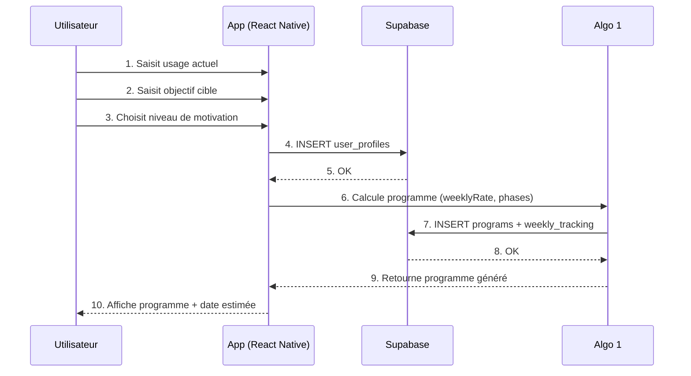

# Séquence 1 — Onboarding & génération du programme

*Diagramme source : `doo_sequence_onboarding.png`*

## Étapes

1. L'utilisateur saisit son usage actuel, son objectif cible et son niveau de motivation dans l'app.
2. L'app insère le profil dans Supabase (`user_profiles`).
3. L'app appelle l'Algo 1 pour calculer le programme (`weeklyRate`, phases).
4. L'Algo 1 insère le programme et le suivi hebdomadaire (`programs` + `weekly_tracking`) dans Supabase, puis retourne le programme généré à l'app.
5. L'app affiche le programme et la date estimée de complétion à l'utilisateur.
