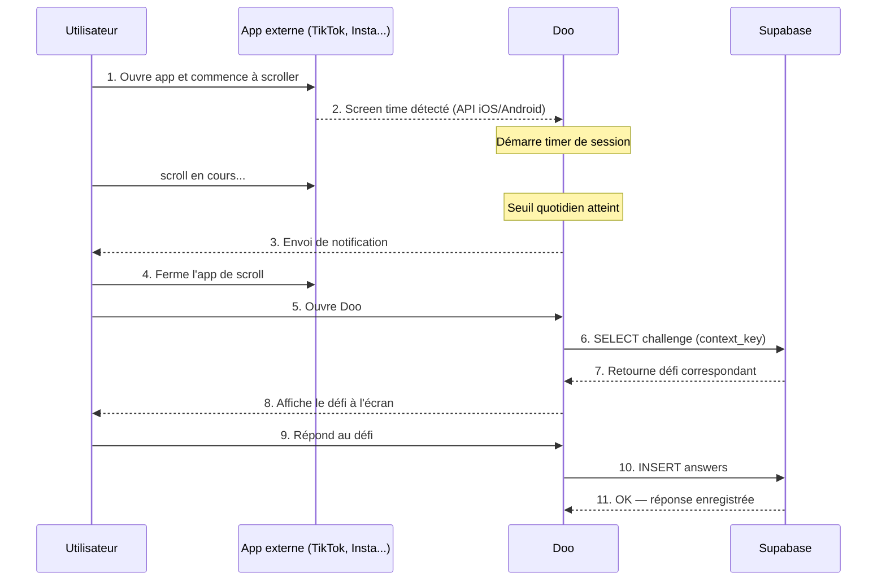

# Séquence 2 — Session de défi (détection scroll + notification)

*Diagramme source : `doo_sequence_session_defi.png`*

## Étapes

1. L'utilisateur ouvre une app externe (TikTok, Instagram...) et commence à scroller.
2. Doo détecte le temps d'écran via l'API native iOS/Android et démarre un timer de session.
3. Une fois le seuil quotidien atteint, Doo envoie une notification (le *Prompt* du modèle de Fogg) à l'utilisateur.
4. L'utilisateur ferme l'app de scroll et ouvre Doo.
5. Doo récupère le défi correspondant au contexte (`SELECT challenge` via `context_key`) et l'affiche à l'écran.
6. L'utilisateur répond au défi ; la réponse est enregistrée dans Supabase (`INSERT answers`).
