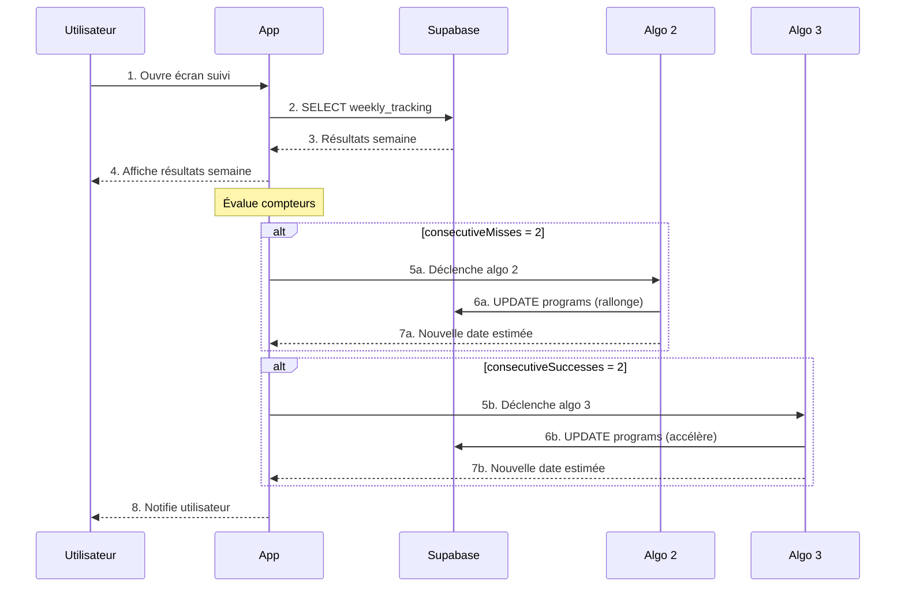

# Séquence 3 — Suivi hebdomadaire & déclenchement des algos 2/3

*Diagramme source : `doo_sequence_suivi_hebdo.png`*

## Étapes

1. L'utilisateur ouvre l'écran de suivi ; l'app récupère les résultats de la semaine (`SELECT weekly_tracking`) et les affiche.
2. L'app évalue les compteurs `consecutiveMisses` et `consecutiveSuccesses`.
3. Si `consecutiveMisses = 2` → déclenchement de l'**Algo 2**, qui met à jour le programme (rallonge) et retourne la nouvelle date estimée.
4. Si `consecutiveSuccesses = 2` → déclenchement de l'**Algo 3**, qui met à jour le programme (accélère) et retourne la nouvelle date estimée.
5. L'app notifie l'utilisateur du résultat.
