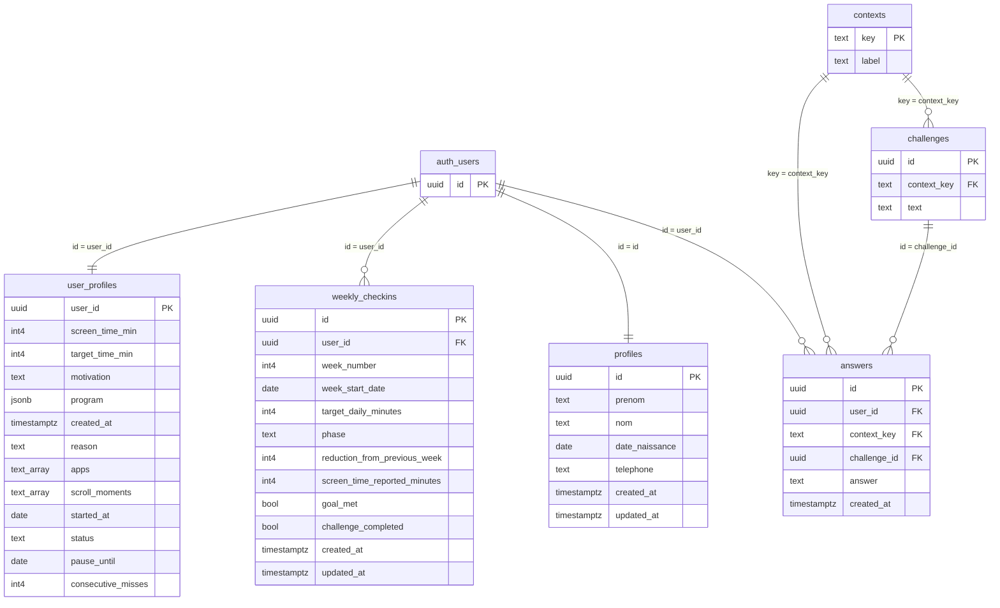

# Schéma de base de données — Supabase

*Diagramme source : `supabase-schema.png`*

> ⚠️ Certains noms de colonnes apparaissaient tronqués dans la capture d'écran source (`ap...`, `pha...`, `reduction_from_previous_...`, `screen_time_reported_min...`). Les noms complets ci-dessous sont une reconstitution probable — à vérifier contre le schéma réel dans Supabase.

*`auth_users` représente la table native `auth.users` gérée par Supabase Auth (non modifiable directement).*

## Tables

### `user_profiles`

| Colonne | Type | Clé |
|---|---|---|
| user_id | uuid | PK, FK → auth.users.id |
| screen_time_min | int4 | |
| target_time_min | int4 | |
| motivation | text | |
| program | jsonb | |
| created_at | timestamptz | |
| reason | text | |
| apps | _text | |
| scroll_moments | _text | |
| started_at | date | |
| status | text | |
| pause_until | date | |
| consecutive_misses | int4 | |

### `weekly_checkins`

| Colonne | Type | Clé |
|---|---|---|
| id | uuid | PK |
| user_id | uuid | FK → auth.users.id |
| week_number | int4 | |
| week_start_date | date | |
| target_daily_minutes | int4 | |
| phase | text | |
| reduction_from_previous_week | int4 | |
| screen_time_reported_minutes | int4 | |
| goal_met | bool | |
| challenge_completed | bool | |
| created_at | timestamptz | |
| updated_at | timestamptz | |

### `profiles`

| Colonne | Type | Clé |
|---|---|---|
| id | uuid | PK, FK → auth.users.id |
| prenom | text | |
| nom | text | |
| date_naissance | date | |
| telephone | text | |
| created_at | timestamptz | |
| updated_at | timestamptz | |

### `answers`

| Colonne | Type | Clé |
|---|---|---|
| id | uuid | PK |
| user_id | uuid | FK → auth.users.id |
| context_key | text | FK → contexts.key |
| challenge_id | uuid | FK → challenges.id |
| answer | text | |
| created_at | timestamptz | |

### `contexts`

| Colonne | Type | Clé |
|---|---|---|
| key | text | PK |
| label | text | |

### `challenges`

| Colonne | Type | Clé |
|---|---|---|
| id | uuid | PK |
| context_key | text | FK → contexts.key |
| text | text | |

## Relations

- `user_profiles.user_id` → `auth.users.id`
- `weekly_checkins.user_id` → `auth.users.id`
- `profiles.id` → `auth.users.id`
- `answers.user_id` → `auth.users.id`
- `answers.context_key` → `contexts.key`
- `answers.challenge_id` → `challenges.id`
- `challenges.context_key` → `contexts.key`
