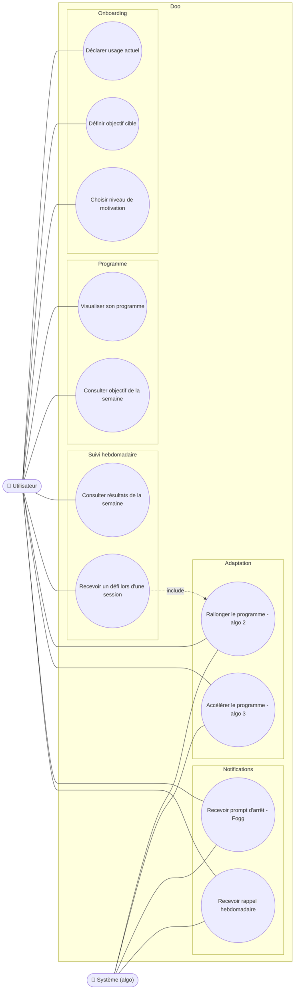

# Diagramme de cas d'utilisation — Doo

*Diagramme source : `doo_uml_cas_utilisation.png`*

Acteurs : **Utilisateur** et **Système (algo)**.

## Cas d'utilisation par catégorie

**Onboarding**
- Déclarer usage actuel
- Définir objectif cible
- Choisir niveau de motivation

**Programme**
- Visualiser son programme
- Consulter objectif de la semaine

**Suivi hebdomadaire**
- Consulter résultats de la semaine
- Recevoir un défi lors d'une session *(inclut : Rallonger le programme — algo 2)*

**Adaptation**
- Rallonger le programme (algo 2)
- Accélérer le programme (algo 3)

**Notifications**
- Recevoir prompt d'arrêt (Fogg)
- Recevoir rappel hebdomadaire

## Acteurs et associations

- **Utilisateur** est associé à l'ensemble des cas d'utilisation.
- **Système (algo)** est associé aux cas : Rallonger le programme (algo 2), Accélérer le programme (algo 3), Recevoir prompt d'arrêt (Fogg), Recevoir rappel hebdomadaire.
